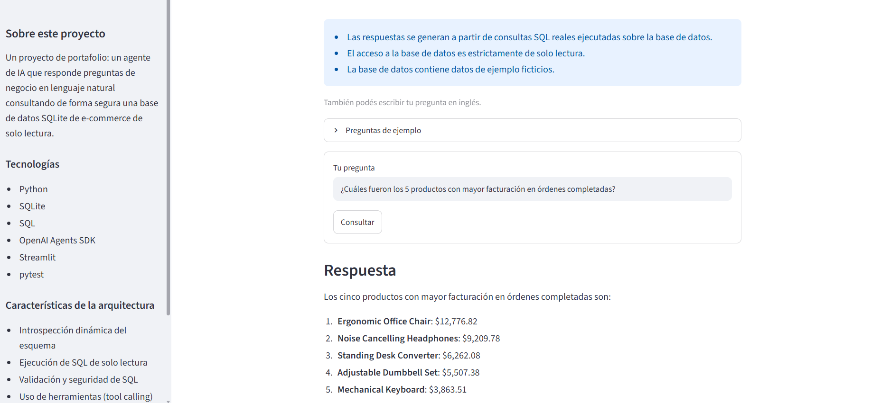
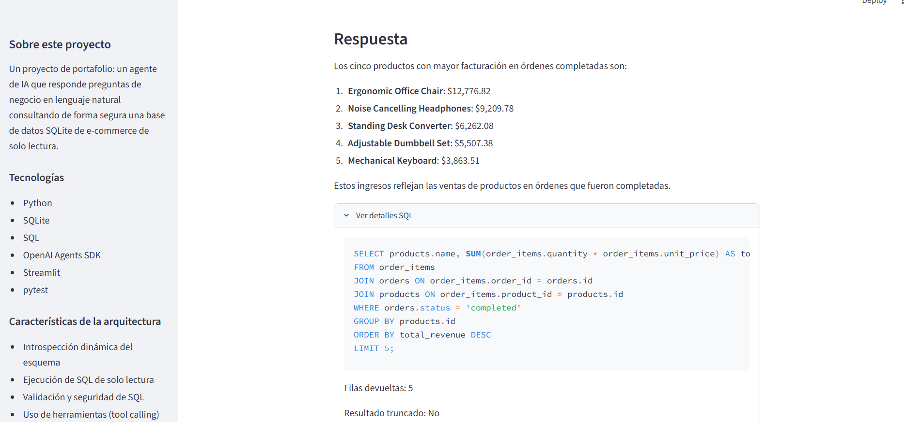
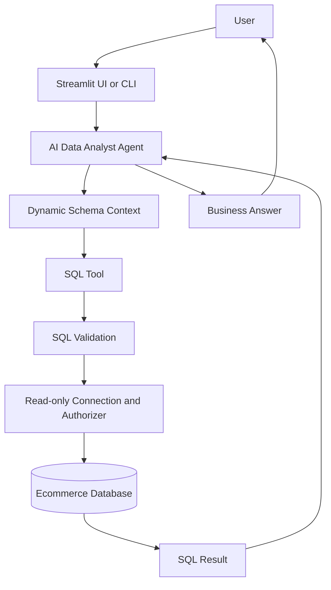

# AI SQL Data Analyst Agent

**AI SQL Data Analyst Agent** lets non-technical stakeholders ask business
questions in plain language — English or Spanish — and get answers
grounded in real data, without writing SQL themselves. The agent
dynamically reads a SQLite ecommerce database's schema, generates the
appropriate SQL, executes it through a validated, read-only tool, and
turns the result into a clear business answer. An automated test suite
(233 tests) and an end-to-end evaluation framework (scoring **10/10,
100%** on its most recent run) back up the implementation.

## Demo

Two front ends are available, both calling the same backend agent:

- **Streamlit UI** (interface in Spanish) — `streamlit run streamlit_app.py`
- **CLI** (English) — `python app.py`, with an optional `--debug` flag
  that prints the SQL the agent ran for each answer

The agent itself understands and answers in **both English and
Spanish**, regardless of which front end you use — the Streamlit UI's
labels are in Spanish, but a question can be typed in either language on
either front end, and the agent replies in the same language the
question was asked in.

No live deployment exists yet; run the app locally with the
[Getting Started](#getting-started) instructions below.

## Screenshots



A natural-language business question, asked in Spanish through the
Streamlit UI, answered using data pulled live from the ecommerce
database.



The expanded "Ver detalles SQL" panel from the same answer, showing the
SQL tool call the agent made, the number of rows it returned, and its
execution time.

## Key Features

- Natural-language data analysis over a real relational database
- OpenAI Agents SDK tool calling — the agent decides when and how to query data
- Dynamic schema introspection (table/column knowledge is never hardcoded into prompts)
- Safe, read-only SQL execution (a single `SELECT`, optionally with `WITH`, per call)
- Defense-in-depth SQL security (text validation + read-only connection + SQLite authorizer)
- Multilingual responses (English and Spanish, matched to the question's language)
- SQL tool-call observability (query text, rows returned, truncation, timing, errors)
- Automated test suite (233 tests, no real API calls)
- End-to-end agent evaluation framework, scored against trusted SQL ground truth

## Architecture



The agent (`agent/data_analyst_agent.py`, built on the OpenAI Agents SDK)
never opens a database connection itself and never receives raw
database access. At construction time it's given the database's current
schema as context (`tools/schema_tool.py`); at question time, its only
way to read data is a single tool, `run_sql_query`, which is a thin
wrapper around `tools/sql_tool.py`'s `execute_read_only_query()`. Every
query the model writes passes through SQL validation and a read-only
connection before it ever touches SQLite — the model has no path to the
database that bypasses those layers. The tool's result (rows, not raw
model reasoning) goes back to the agent, which turns it into a business
answer.

### Database

The domain is a fictional ecommerce business: `customers`, `products`,
`orders`, and `order_items` (schema in `database/schema.sql`), with
foreign keys from `orders.customer_id` to `customers` and from
`order_items` to both `orders` and `products`.

`database/seed_db.py` generates a deterministic sample dataset (~100
customers, 30 products, 500–800 orders and their line items, spread
across a fixed 12-month period) from a fixed random seed, so the same
command always produces the same data — this is what makes the
evaluation framework's ground truth reproducible. Seeding is idempotent:
if `customers` already has rows, it's a no-op.

```bash
python -m database.init_db   # creates the schema
python -m database.seed_db   # populates it with sample data
```

Example analytical queries this dataset supports (also encoded as
assertions in `tests/test_seed_db.py`):

```sql
-- Total revenue from completed orders
SELECT SUM(oi.quantity * oi.unit_price)
FROM order_items oi
JOIN orders o ON o.id = oi.order_id
WHERE o.status = 'completed';

-- Top 5 products by revenue
SELECT p.name, SUM(oi.quantity * oi.unit_price) AS revenue
FROM order_items oi
JOIN orders o ON o.id = oi.order_id
JOIN products p ON p.id = oi.product_id
WHERE o.status = 'completed'
GROUP BY p.id
ORDER BY revenue DESC
LIMIT 5;

-- Monthly sales trend
SELECT strftime('%Y-%m', o.order_date) AS month,
       SUM(oi.quantity * oi.unit_price) AS revenue
FROM order_items oi
JOIN orders o ON o.id = oi.order_id
WHERE o.status = 'completed'
GROUP BY month
ORDER BY month;
```

### SQL tool observability

Every `run_sql_query` call is recorded as a `SQLToolCallRecord`: the
query text, whether it succeeded, `row_count`, `truncated`,
`execution_time_ms`, and the error message if it failed. It never
records API keys, secrets, or full prompts. The CLI's `python app.py
--debug` and the Streamlit UI's "Ver detalles SQL" ("View SQL details")
expander both surface this same data so a technical reviewer can see
exactly what SQL produced an answer — never the model's internal
reasoning, which the SDK does not expose to this application in the
first place.

## Security

The database can't be modified through this agent, even by a mistake in
generated SQL, because of three independent layers:

1. **SQL validation** (`tools/sql_tool.py::validate_read_only_sql`) — an
   allow-list, not just a blocklist: only a single `SELECT` statement,
   optionally starting with `WITH`, is accepted. Empty input, multiple
   statements, and statements such as `INSERT`, `UPDATE`, `DELETE`,
   `DROP`, `ALTER`, `CREATE`, `ATTACH`, `PRAGMA`, and transaction control
   (`BEGIN`/`COMMIT`/`ROLLBACK`) are rejected before anything touches
   the database.
2. **Read-only SQLite connection** — opened via a `file:...?mode=ro` URI
   plus `PRAGMA query_only = ON`, so SQLite itself refuses writes
   regardless of what SQL text arrives.
3. **SQLite authorizer** — `sqlite3.Connection.set_authorizer` allow-lists
   only the actions a plain `SELECT` needs (read, select, function,
   recursive) and denies everything else — including `ATTACH`, which
   could otherwise be used to write to a different file — independent of
   what the text validator decided.

Additional practices:

- Query results are capped (`max_rows`, default 100) so a single query
  can't pull an unbounded result set.
- Secrets (`OPENAI_API_KEY`) live only in environment variables / a
  local `.env` file, which is listed in `.gitignore` and never committed
  — only `.env.example` (with blank values) is.
- The agent never receives a writable database handle at any point; the
  read-only connection and validation described above are the *only*
  way it can reach SQLite.

## Agent Evaluation

Unit tests validate deterministic application logic with mocks and never
touch the OpenAI API — they can't tell you whether the *agent* answers a
real business question correctly. `evals/` is a separate, small
evaluation suite that runs representative questions through the real
agent and grades its end-to-end behavior. It is intentionally not a
unit-test replacement, and `pytest` never runs it automatically.

- **`evals/eval_cases.py`** — 10 representative cases: revenue by
  product/category, top customers, best sales month, average order
  value, an order-status breakdown, a category comparison, a
  multi-`JOIN` question, one question the schema cannot answer, and one
  general/conversational question. Each case is a question plus
  metadata — never a hardcoded answer.
- **`evals/ground_truth.py`** — trusted SQL, written by hand for this
  suite and kept separate from the agent's own instructions, computes
  the objective expected answer directly from the live database. Ground
  truth is never computed by asking the AI agent.
- **`evals/checks.py`** — small, explainable, rule-based checks (no
  LLM-as-a-judge): did the agent use `run_sql_query` when it should have
  (and *not* when it shouldn't)? Do the expected entity names appear in
  the answer? Does a number close enough to the expected value appear?
  For the unsupported question, does the answer hedge instead of
  inventing a number, rather than confidently fabricating one?

The most recent real run scored **10/10 (100%)**:

```
AI DATA AGENT EVALUATION

PASS  top_products_revenue
PASS  top_category_revenue
PASS  top_customers_spending
PASS  best_sales_month
PASS  average_completed_order_value
PASS  order_count_by_status
PASS  category_comparison
PASS  multi_join_question
PASS  unsupported_question
PASS  conversational_question

Score: 10/10 (100%)
```

The runner also reports the average agent execution time and total SQL
tool calls across all cases. Running it for real calls the OpenAI API
once per case and consumes API usage — see
[Running Agent Evaluations](#running-agent-evaluations).

## Test Coverage

**233 pytest tests passing.** They cover:

- Database initialization and deterministic seeding
- SQL validation and read-only execution (including that rejected/unsafe
  queries leave the database unchanged)
- Dynamic schema introspection
- Agent construction and wiring (schema injection, tool delegation,
  configuration/error handling)
- SQL tool-call observability (successful and failed call metadata)
- The evaluation framework itself (case structure, ground-truth SQL,
  scoring, checks, report formatting)
- Streamlit UI helper functions and app smoke tests (`streamlit.testing.v1.AppTest`)

`pytest` uses mocks for every OpenAI API interaction (`Runner.run_sync`
is always monkeypatched) and never consumes API credits. Only
`python -m evals.run_evals` and normal use of `app.py` /
`streamlit_app.py` call the real API. Code coverage has not been
measured, so no coverage percentage is claimed.

## Tech Stack

| Category | Technology |
|---|---|
| Language | Python 3.13 |
| Database | SQLite / SQL |
| AI | OpenAI Agents SDK |
| Web UI | Streamlit |
| Testing | pytest |
| Version control | Git / GitHub |

## Project Structure

```
ai-sql-data-agent/
├── app.py                    # CLI entry point
├── streamlit_app.py          # Streamlit UI (Spanish)
├── agent/
│   └── data_analyst_agent.py # Agent construction, tool wiring, execution
├── tools/
│   ├── sql_tool.py           # Safe, read-only SQL validation and execution
│   └── schema_tool.py        # Dynamic schema introspection
├── database/
│   ├── schema.sql            # Table definitions
│   ├── init_db.py            # Creates the SQLite database
│   └── seed_db.py            # Deterministic sample data generator
├── evals/
│   ├── eval_cases.py         # Representative evaluation questions
│   ├── ground_truth.py       # Trusted SQL for objective expected answers
│   ├── checks.py             # Rule-based pass/fail checks
│   ├── runner.py             # Runs cases against the agent and grades them
│   └── run_evals.py          # CLI: python -m evals.run_evals
├── tests/                    # pytest suite (mocked, no real API calls)
├── data/                     # Local SQLite database file (not committed)
├── docs/
│   └── screenshots/          # UI screenshots referenced in this README
├── .env.example
└── requirements.txt
```

## Getting Started

```powershell
python -m venv .venv
.venv\Scripts\Activate.ps1
pip install -r requirements.txt
Copy-Item .env.example .env
```

Edit `.env` and set `OPENAI_API_KEY` (required to run the agent — get
one at https://platform.openai.com/api-keys). `OPENAI_MODEL` and
`DATABASE_PATH` are optional and fall back to sensible defaults if left
blank. Never commit `.env` — it's already in `.gitignore`.

Then initialize and seed the database:

```powershell
python -m database.init_db
python -m database.seed_db
```

## Running the Application

CLI:

```powershell
python app.py
```

CLI with SQL observability:

```powershell
python app.py --debug
```

Streamlit (Spanish UI):

```powershell
streamlit run streamlit_app.py
```

## Example Questions

The agent discovers every answer through SQL at run time — none of
these have hardcoded answers.

**English**

- What are the top 5 products by completed-order revenue?
- Which category generated the most revenue?
- Who are the top 5 customers by spending?
- What was the best sales month?
- What is the average completed order value?

**Español**

- ¿Cuáles fueron los 5 productos con mayor facturación?
- ¿Qué categoría generó más ingresos?
- ¿Quiénes fueron los 5 clientes con mayor gasto?
- ¿Cuál fue el mejor mes de ventas?

## Running Tests

```powershell
pytest
```

233 tests, all mocked — no real OpenAI API calls, no API usage consumed.

## Running Agent Evaluations

```powershell
python -m evals.run_evals
```

This calls the real OpenAI API once per evaluation case and **consumes
API usage** — it needs `OPENAI_API_KEY` set and the database initialized
and seeded first. See [Agent Evaluation](#agent-evaluation) for what it
checks and the most recent result.

## Design Decisions

- **SQLite** over a client-server database: zero setup for anyone
  cloning the repo, while still exercising real SQL, joins, and
  constraints — appropriate for a portfolio demo, not a production
  deployment.
- **Schema introspected dynamically, not duplicated in prompts** —
  `tools/schema_tool.py` reads the live schema via SQLite's own
  `PRAGMA` introspection, so the agent's instructions can never drift
  out of sync with the actual database.
- **The LLM never connects directly to the database** — it only ever
  calls the `run_sql_query` tool, which enforces validation and a
  read-only connection independently of the model's behavior.
- **Deterministic seeded dataset** — a fixed random seed makes the
  sample data (and therefore the evaluation suite's ground truth)
  reproducible across machines and runs.
- **Agent evaluations kept separate from unit tests** — unit tests check
  deterministic logic with mocks; evaluations check real end-to-end
  agent behavior against a live model, and are run deliberately rather
  than on every `pytest` invocation.

## Limitations / Future Improvements

Current limitations:

- SQLite rather than a production-grade database
- Single-agent architecture (no multi-agent orchestration)
- No conversational memory — each question is an independent agent run
- No authentication
- Not deployed; runs locally only

Possible future extensions:

- A production database such as PostgreSQL
- Richer evaluation metrics and a larger case set
- Charts/visualizations in the Streamlit UI
- A hosted deployment
- More complex agent orchestration, if a real requirement justifies it
